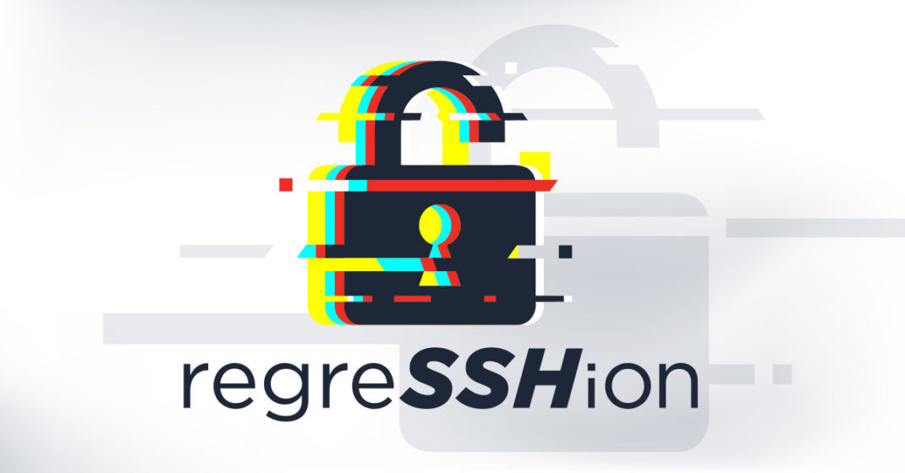

# サーバーレスエンジニアのための体験型Linux入門

## このハンズオンについて

これは、クラスメソッド株式会社の [DevelopersIO 2024 Odyssey](https://classmethod.jp/m/odyssey/) の2024年7月20日に開催された次の Linux ワークショップのために作成されたものです。

## サーバーレスエンジニアのための体験型Linux入門

サーバーレス技術の普及に伴い、エンジニアがOSを意識する機会は大幅に減りました。とはいえ、そのようなエンジニアが技術領域を広げるために、サーバーレスの対極にあるサーバーフルな世界に足を踏み入れる選択肢があってもよいでしょう。

2024年7月に`sshd`に関する脆弱性[regreSSHion(CVE-2024-6387)](https://unit42.paloaltonetworks.com/threat-brief-cve-2024-6387-openssh/)が公開されました。

脆弱性を発見した Qualys のエンジニアブログでは、regreSSHion について以下のような解説があります。

> The vulnerability, which is a **signal handler race condition** in **OpenSSH’s server (sshd)**, allows unauthenticated remote code execution (RCE) as **root** on **glibc-based** Linux systems; that presents a significant security risk. This **race condition** affects **sshd** in its default configuration.
>
> [regreSSHion: Remote Unauthenticated Code Execution Vulnerability in OpenSSH server | Qualys Security Blog](https://blog.qualys.com/vulnerabilities-threat-research/2024/07/01/regresshion-remote-unauthenticated-code-execution-vulnerability-in-openssh-server)

脆弱性の解説記事に現れるこれら Linux OS の関連概念をサーバーレスエンジニア向けに初等的に体験してもらうのが、本ワークショップの狙いです。

## 目次

- [環境セットアップ](setup/README.md)
- [regreSSHionとは](regresshion/README.md)
- [ルート権限](root/README.md)
- [ライブラリ](library/README.md)
- [プロセス](process/README.md)
- [スレッド](thread/README.md)
- [シグナル](signal/README.md)
- [まとめ](summary/README.md)
