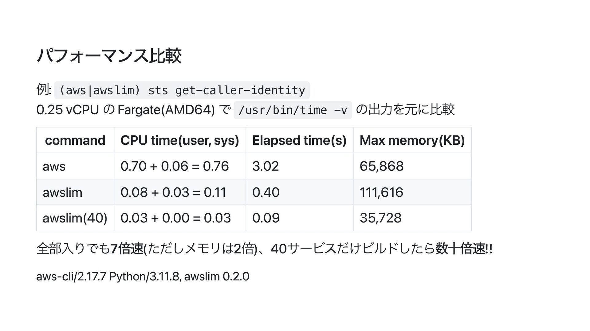

## ライブラリとは?


> The vulnerability, which is a signal handler race condition in OpenSSH’s server (sshd), allows unauthenticated remote code execution (RCE) as root on **glibc-based** Linux systems; that presents a significant security risk. This race condition affects sshd in its default configuration.


プログラミング言語は、文字列処理やファイル操作やネットワーク通信のような頻出操作をかんたんに行うためのライブラリを提供します。
C言語の場合、ISOが標準ライブラリを定めています。

glibc はGNUプロジェクトによる標準ライブラリの実装であり、Linux環境で広く使われています。

Linuxでは、 `man` コマンドでリファレンス・マニュアルを読めます。

コマンドから `$ man glibc` を実行しましょう。man ページは `q` で終了できます。

```
$ man glibc  # あるいは $ man 7 libc


libc(7)                                            Miscellaneous Information Manual                                           libc(7)

NAME
       libc - overview of standard C libraries on Linux

DESCRIPTION
       The  term “libc” is commonly used as a shorthand for the “standard C library” a library of standard functions that can be used
       by all C programs (and sometimes by programs in other languages).  Because of some history (see below), use of the term “libc”
       to refer to the standard C library is somewhat ambiguous on Linux.

   glibc
       By far the most widely used C library on Linux is the GNU C Library, often referred to as glibc.  This is the C  library  that
       is  nowadays  used  in  all  major Linux distributions.  It is also the C library whose details are documented in the relevant
       pages of the man-pages project (primarily in Section 3 of the manual).  Documentation of glibc is also available in the  glibc
       manual,  available  via  the command info libc.  Release 1.0 of glibc was made in September 1992.  (There were earlier 0.x re‐
       leases.)  The next major release of glibc was 2.0, at the beginning of 1997.

       The pathname /lib/libc.so.6 (or something similar) is normally a symbolic link that points to the location of  the  glibc  li‐
       brary, and executing this pathname will cause glibc to display various information about the version installed on your system.
```

## 補足:man について

Linuxでは、 `man` コマンドでマニュアル(**man**nual)を読めます。

マニュアルの種類に応じて、次の1から9のセクションが割り振られ、`$ man section page` という構文で呼び出します。

1.   Executable programs or shell commands
2.   System calls (functions provided by the kernel)
3.   Library calls (functions within program libraries)
4.   Special files (usually found in /dev)
5.   File formats and conventions, e.g. /etc/passwd
6.   Games
7.   Miscellaneous (including macro packages and conventions), e.g. man(7), groff(7), man-pages(7)
8.   System administration commands (usually only for root)
9.   Kernel routines [Non standard]

`$ man man` とすると `MAN(1)` に誘導されます。
これは、`man` はプログラムのため、セクション1に該当することを意味し、`$ man 1 man` と呼び出しても同じです。

ページだけではセクションが一意に定まらない例もあり、`$ man 1 printf` とすると、`printf` コマンドのページが表示され、`$ man 3 printf` とすると、`glibc` 等で実装されたC言語のライブラリ関数の `printf(3)` 関数のページが表示されます。

man でマニュアルを見ながらライブコーディングしている実例

https://youtu.be/P6w_5gJw3IY?si=EHtqce_aT-WvEu5c&t=135

`man` はLinuxの前身のUNIXの1970年代の黎明期から存在しました。

インターネットがない時代は、マニュアルは、印刷物、あるいは、OSに内包されている必要があり、`man` は後者での提供です。

参考 [History of UNIX Manpages](https://manpages.bsd.lv/history.html)

## glibc を使ってみる

C言語で "hello, world" プログラムを作成し、glibcのライブラリ関数である `printf(3)` を呼び出します。

```
#include <stdio.h>

int main() {
    printf("hello, world\n");
    return 0;
}
```

C言語のコンパイラである `gcc` でコンパイルします

```
$ gcc hello.c
$ ls
a.out  hello.c
$ ./a.out # 実行ファイル
hello, world
```

Cの実行ファイルの作成は次の2ステップからなります。

1. ソースコードからオブジェクトファイルを作成
2. オブジェクトファイルとライブラリをリンクして実行ファイルを作成

コマンド `$ gcc -o hello hello.c` はこの2つの処理を1ステップで行っています。

これを2ステップに分割する場合は次のようにします:

```
$ gcc -c hello.c -o hello.o # ステップ1 : オブジェクトファイルの作成
$ gcc hello.o -o hello_c    # ステップ2 : オブジェクトファイルとライブラリのリンク
$ ./hello_c
hello, world

$ file hello.o  # オブジェクトファイル
hello.o: ELF 64-bit LSB relocatable, x86-64, version 1 (SYSV), not stripped

$ file hello_c  # 実行ファイル
hello: ELF 64-bit LSB pie executable, x86-64, version 1 (SYSV), dynamically linked, interpreter /lib64/ld-linux-x86-64.so.2, BuildID[sha1]=b3e50f2741351b23a37148846fc2a42a6394f609, for GNU/Linux 3.2.0, not stripped
```

大規模プログラムでは、分割コンパイルが求められます。

オブジェクトファイルやライブラリを結合して一つの実行ファイルに作成するプログラムをリンカと呼びます。`ld`(gcc デフォルト)、`lld`(LLVM)、`mold`(`lld`作者による次世代リンカ)などがありです。

参考 [『リンカー moldをいろんなターゲットに移植した話』を視聴してCPUやpsABIの世界を覗き見してみた #kernelvm](https://zenn.dev/quiver/articles/7aa6deb2d77e44)

## 共有ライブラリと静的ライブラリ

ライブラリの利用方法は2種類あります

- 共有ライブラリ
    - プログラムが実行時にライブラリを参照する(動的リンク)
    - 多くのプログラミング言語が採用
    - Linuxだと `.so`ファイル、Windowsだと `.DLL`(Dynamic Link Library)
- 静的ライブラリ
    - プログラムにライブラリを組み込む(静的リンク)
    - Go言語が採用
    - Linuxだと `.a`ファイル(`ar` コマンドを利用して複数のオブジェクトファイルをアーカイブ化)

## 共有ライブラリを確認

実行ファイルが依存する共有ライブラリは `ldd` プログラムで確認できます(`$ man 1 ldd`)

```
$ ldd ./a.out
        linux-vdso.so.1 (0x00007ffe02dcf000)
        libc.so.6 => /lib/x86_64-linux-gnu/libc.so.6 (0x00007eb1a3e00000)
        /lib64/ld-linux-x86-64.so.2 (0x00007eb1a408e000)
```

`.so` は shared objects(共有ライブラリ)を表します。

バイナリファイルからテキストを抜き出す `strings` プログラムを利用して、`libc.so.6` の実体が glibc(GNU C Library) であることを確認します。

```
$ strings /lib/x86_64-linux-gnu/libc.so.6 | grep GNU
GNU C Library (Ubuntu GLIBC 2.39-0ubuntu8.2) stable release version 2.39.
Compiled by GNU CC version 13.2.0.
```

## Go言語は静的リンク

多くの言語はライブラリを動的リンクしますが、Go言語はデフォルトで静的リンクします。

次の `hello.go` ファイルを用意します。

```
package main

import "fmt"

func main() {
    fmt.Println("hello, world")
}
```

コンパイルして実行します。

```
$ go build -o hello_go hello.go
$ ./hello_go
hello, world
```

`ldd` や `file` から、静的リンク(`statically linked`)されていることがわかります。

```
$ ldd hello
        not a dynamic executable

$ file hello
hello: ELF 64-bit LSB executable, x86-64, version 1 (SYSV), statically linked, Go BuildID=A90LZtCkwgdOUoJtexOQ/iNVx11jHsmJ7aeiqlqKe/0EYraerkXrcvu0txJPvy/St2KmXJJMkh5V-u0vDo-, with debug_info, not stripped
```

## 静的ライブラリのメリット・デメリット

静的リンクすると、実行ファイルを配布するだけ動作し、動的リンク時のように、実行環境でのライブラリの存在を意識しなくてすみます。

一方で、ライブラリをプログラムに直接組み込むため、ファイルサイズが大きくなります。

"hello, world"を表示するだけのC言語とGo言語のファイルサイズを比較します。

```
$ ls -lh hello_go hello_c
-rwxrwxr-x 1 ubuntu ubuntu  16K Jul  9 03:52 hello_c
-rwxrwxr-x 1 ubuntu ubuntu 1.9M Jul  9 04:06 hello_go
```

動的リンクしたC版は16Kなのに対して、静的リンクしたGo版は1.9Mと100倍以上の開きがあります。

## 発展:コンテナでの静的リンクの活用例

コンテナでは、プログラムをビルドし、生成されたアーティファクトを実行します

```
FROM golang:1.21
WORKDIR /src
COPY <<EOF ./main.go
package main

import "fmt"

func main() {
  fmt.Println("hello, world")
}
EOF
RUN go build -o /bin/hello ./main.go

CMD ["/bin/hello"]
```

このコンテナイメージには、Goのコンパイラやライブラリ群も含むため、サイズが肥大化します。

コンテナのビルドには **マルチステージビルド** という手法があり、ビルド時と実行時でベースイメージを分け、ビルドフェーズで作成したアーティファクトだけを軽量なベースイメージで実行させることができます。

Goのように静的リンクされている場合、依存するライブラリはバイナリに組み込まれているため、マルチステージビルドと相性がよいです。

```
FROM golang:1.21
WORKDIR /src
COPY <<EOF ./main.go
package main

import "fmt"

func main() {
  fmt.Println("hello, world")
}
EOF
RUN go build -o /bin/hello ./main.go

FROM scratch
COPY --from=0 /bin/hello /bin/hello
CMD ["/bin/hello"]
```

※ Dockerfileの引用元 https://docs.docker.com/build/building/multi-stage/

## CPUアーキテクチャとクロスコンパイル

主要パブリッククラウドでは、CISC(Complex Instruction Set Computing)命令セットのIntel/AMD(x86)とRISC(Reduced Instruction Set Computing)命令セットのArm(arm)という、まったく異なるCPUアーキテクチャを利用できます。

AWS Gravitionチップや最近のMacやスマートフォンはArm系であり、1世代前のMacや市場で入手可能なほとんどのサーバーはx86系です。

GoでコンパイルしたバイナリはLinuxならどこでも動くわけではなく、それぞれのCPUアーキテクチャ向けにコンパイルする必要があります。

コンパイラによっては、異なるアーキテクチャをターゲットにコンパイル可能であり、クロスコンパイルと呼びます。

Go において、x86_64(x86の64ビット)環境で arm64(armの64ビット)環境向けにコンパイルする場合、次の様に `GOARCH=arm64` を渡します。

```
$ GOARCH=arm64 go build -o hello_arm64 hello.go

$ file hello_arm64
hello_arm64: ELF 64-bit LSB executable, ARM aarch64, version 1 (SYSV), statically linked, Go BuildID=FZ2AWXSFUuSYLS3Mxpkr/SlETPZpre-ppkjqaPiD5/Ax0CehQj51JoVk4Pl26k/j5j7u9T703xJIpUt_JGq, with debug_info, not stripped
```

x86_64環境では、アーキテクチャが異なるため、実行できません

```
$ uname -m
x86_64

$ ./hello_arm64
-bash: ./hello_arm64: cannot execute binary file: Exec format error

$ file ./hello_arm64
./hello_arm64: ELF 64-bit LSB executable, ARM aarch64, version 1 (SYSV), statically linked, Go BuildID=FZ2AWXSFUuSYLS3Mxpkr/SlETPZpre-ppkjqaPiD5/Ax0CehQj51JoVk4Pl26k/j5j7u9T703xJIpUt_JGq, with debug_info, not stripped
```

## コンテナのCPUアーキテクチャ

パブリッククラウド環境(アプリの実行環境)では、x86だけでなくAWS GravitonのようなArm系プロセッサをサーバーレスアプリケーションでも手軽に利用できます(例:AWS Lambda/AWS ECS Fargate)。
また、Arm系のMacをローカル開発環境にしている人も多く、[GitHub ActionsもArmに対応し](https://github.blog/2024-06-03-arm64-on-github-actions-powering-faster-more-efficient-build-systems/
)、結果的に、Armでビルドしたものをx86で実行したり、x86でビルドしたものをArmで実行するケースが増えています。

TODO:具体例のリンクを追加

## スクリプト言語からC等で書かれたバイナリのライブラリを呼ぶときの問題

PythonやRubyのようなスクリプト言語は、基本的には、言語のインタープリターさえインストールされていれば、OSやCPUアーキテクチャーに関係なく実行できます。

しかし、高速化等のために、Cのようなコンパイル言語で実装されたライブラリは、実行環境向けのライブラリが必要です。

例として、同じx86_64のCPUアーキテクチャーでありながら、開発環境がWindowsで実行環境がLinux、同じLinux環境でありながら、開発環境がx86_64、実行環境がARM64（AArch64）のようなケースが該当します。

そのような場合は、デプロイ時に実行環境向けのパッケージを同梱させる必要があります。

- [postgresql - AWS Lambda Importing psycopg2 - Unable to import module 'app': No module named 'psycopg2._psycopg - Stack Overflow](https://stackoverflow.com/questions/74396827/aws-lambda-importing-psycopg2-unable-to-import-module-app-no-module-named)

## 発展:Python LambdaでCバインディングを静的リンクしたはなし

psycopg2 はPostgreSQLクライアント用Cインターフェース libpq のラッパーであり、標準では libpq を動的リンクします。
AWS Lambda の実行環境では libpq は共有ライブラリとしてインストールされていないため、静的リンクして解決。

[AWS Lambda Pythonからpsycopg2でRDS PostgreSQLに接続する \| DevelopersIO](https://dev.classmethod.jp/articles/build-psycopg2-for-aws-lambda-python/)

## 発展:動的リンクされたプログラムを静的に再実装

AWSはAPIをコマンドラインから操作するためのAWS CLIというPython製のコマンドラインプログラムを提供しています。

https://docs.aws.amazon.com/cli/

Pythonインタープリターとプログラムとライブラリの同梱が必要であることや起動が遅いことから、静的リンクしたシングルバイナリでAWS CLIをGoで(部分的に)実装した人もいます。

[awslim - Goで実装された高速なAWS CLIの代替品を作った/layerx.go#1 - Speaker Deck](https://speakerdeck.com/fujiwara3/layerx-dot-go-number-1)



このスライドでは、静的リンクによる起動時間やバイナリサイズやメモリへの影響や、マルチステージビルドのようなテクニックなども紹介されています。

動的リンクと静的リンクの対比のよい実例です。