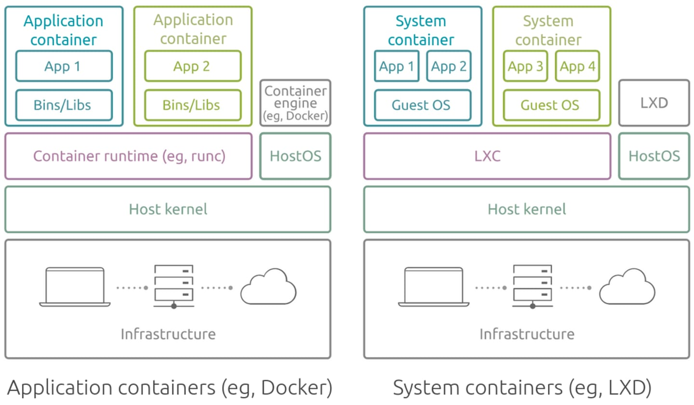
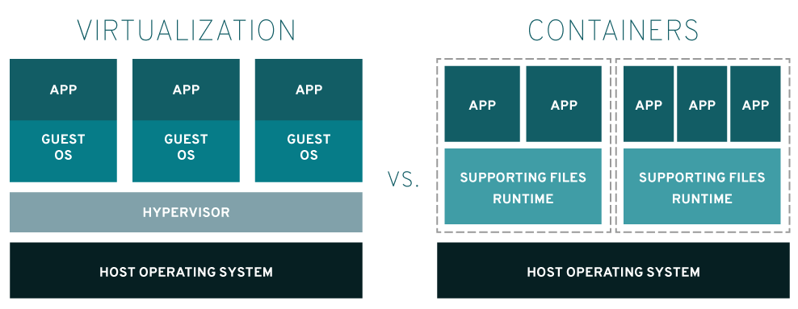

# プロセスとは?

実行中のプログラムのことをプロセスと呼びます。

Linuxでは `ps` コマンド(ps=process status)からプロセス情報を確認できます。

現在ログインしているシェル(=実行中のプログラム)とそのプロセスID(PID)を `$$` 変数から取得します

```
$ echo $SHELL
/bin/bash
$ echo $$
1483
```

ログインユーザー(`ubuntu`)権限で実行されているプロセス一覧を確認します。

```
 $ ps ux
USER         PID %CPU %MEM    VSZ   RSS TTY      STAT START   TIME COMMAND
ubuntu      1025  0.0  0.4  17052  9600 ?        Ss   06:22   0:00 /lib/systemd/systemd --user
...
ubuntu      1483  0.0  0.5  14960 10880 pts/1    Ss   06:22   0:00 bash -l
...
ubuntu      3283  0.0  0.1  10464  3200 pts/1    R+   06:40   0:00 ps ux
```

プロセスIDが1483の `bash` を確認できます。

## Apacheのプロセスを確認

`pstree` コマンドから、プロセスの木構造(`pstree` = `ps` + `tree`)をプロセスID(`-p`オプション)とともに確認します。

```
$ pstree -p
systemd(1)─┬─acpid(367)
...
           ├─apache2(492)─┬─apache2(566)
           │              ├─apache2(568)
           │              ├─apache2(569)
           │              ├─apache2(578)
           │              └─apache2(580)...
```

プロセス名に続くカッコの数字はプロセスID(PID)です。

ブートローダーがLinuxカーネルを起動すると、LinuxカーネルがinitシステムをPID=1で起動し、このシステムを起点に、様々なプログラムが起動されます。
Ubuntu 22.04 では、このinitシステムに `systemd` が採用されています。

`systemd` の概要を公式ページから引用します。

> systemd is a suite of basic building blocks for a Linux system. It provides a system and service manager that runs as PID 1 and starts the rest of the system.
>
> https://systemd.io/


プロセスは、プロセスを管理する側と管理される側が存在します。

`pstree` の出力では、左側が管理する側、右側が管理される側です。

`systemd(1)` と `apache2(492)` の場合、systemdが管理する側、apache2(492)が管理される側です。

systemctl でプロセスのステータスを確認

```
$ systemctl status apache2
● apache2.service - The Apache HTTP Server
     Loaded: loaded (/lib/systemd/system/apache2.service; enabled; vendor preset: enabled)
     Active: active (running) since Wed 2024-07-10 06:22:22 UTC; 21min ago
       Docs: https://httpd.apache.org/docs/2.4/
    Process: 368 ExecStart=/usr/sbin/apachectl start (code=exited, status=0/SUCCESS)
   Main PID: 492 (apache2)
      Tasks: 6 (limit: 2262)
     Memory: 25.9M
        CPU: 199ms
     CGroup: /system.slice/apache2.service
             ├─492 /usr/sbin/apache2 -k start
             ├─566 /usr/sbin/apache2 -k start
             ├─568 /usr/sbin/apache2 -k start
             ├─569 /usr/sbin/apache2 -k start
             ├─578 /usr/sbin/apache2 -k start
             └─580 /usr/sbin/apache2 -k start

Jul 10 06:22:22 ip-172-31-34-13 systemd[1]: Starting The Apache HTTP Server...
Jul 10 06:22:22 ip-172-31-34-13 systemd[1]: Started The Apache HTTP Server.
```

中央に `Main PID: 492 (apache2)` とあります。

プロセスIDの 492, 566, 568, ..., 580 はフラットではなく、492は特別な管理する側であり、566から580が管理される側です。

`pstree` のツリー表示と一致します。

## (発展)デーモンプログラム

`sshd` の最後の `d` は `daemon`(デーモン) を表します(`$ man sshd` によると "sshd (OpenSSH Daemon) is the daemon program for ssh(1). ")。

バックグラウンドで起動されるプログラムをデーモンと呼び、Windowsのサービスのようなものです。

`systemd` が管理するデーモン一覧は次のコマンドで確認できます。

```
$ systemctl list-units --type=service --state=running
```

## (発展)コンテナでのプロセスの考え方

### 1コンテナ1アプリ

アプリケーションをコンテナ化する上で、アプリケーションコンテナとシステムコンテナという2つの考え方があります。



※ [LXD vs Docker \| Ubuntu](https://ubuntu.com/blog/lxd-vs-docker) から

現在主流のアプリケーションコンテナは、APIサーバーなどアプリケーション単位でコンテナ化します。
コンテナ内で、プロセス管理サービスを起動し、複数プロセスを管理するのはアンチパターンとされています。

> コンテナ内で単一のアプリケーションプロセスを実行します。
>
> コンテナの有効期間は、アプリケーションプロセスが実行されている期間です。Amazon ECS は、クラッシュしたプロセスを置き換えると共に、置き換え後のプロセスをどこで起動するかを決定します。適切に完成されたイメージは、デプロイ全体の耐障害性を高めます。
> [Best practices for Amazon ECS container images - Amazon Elastic Container Service](https://docs.aws.amazon.com/ja_jp/AmazonECS/latest/developerguide/container-considerations.html)

Twelve-Factor App の VI. プロセスでも "アプリケーションを1つもしくは複数のステートレスなプロセスとして実行する" とあります。

[The Twelve-Factor App （日本語訳）](https://12factor.net/ja/processes)

システムコンテナはLXDなどで採用され、名前の通り、複数のアプリケーションからなるシステム全体を一つのコンテナに閉じ込めます。

以降では、「コンテナ」は「アプリケーションコンテナ」を指します。

### PID Namespaceによる独立したプロセス空間

OSの上でOSを動かす仮想技術とことなり、コンテナはOSの上で1アプリケーションとして動かします。



※ 引用元 https://www.redhat.com/en/topics/containers/containers-vs-vms

コンテナを起動するホストからは、コンテナは1プロセスとして見えていますが、コンテナの内では独立したプロセス空間を持ち、アプリケーションはPID=1で実行されます。

Linuxカーネルの Namespaces という機能が利用されており(PID namespace)、コンテナを支える非常に重要な機能の一つです。

### (発展)PID Namespaceの実験例

1000秒間sleep(`sleep 1000`)するコンテナを起動

```
$ docker run -d --name test-sleep ubuntu sleep 1000
40c31a5befe1ed6d75b990713aaed63d9fd429a450d691f6dce44c3d89ba5429
```

コンテナ内からプロセス(`sleep 1000`)を確認すると、PID = 1 で動作している
```
$ docker exec -it test-sleep ps -ef
UID          PID    PPID  C STIME TTY          TIME CMD
root           1       0  0 14:24 ?        00:00:00 sleep 1000
root          38       0 40 14:27 pts/0    00:00:00 ps -ef
```

ホストからコンテナのプロセス(`sleep 1000`) を確認すると、PID = 2194 で動作している

```
$ docker top test-sleep
UID                 PID                 PPID                C                   STIME               TTY                 TIME                CMD
root                2216                2194                0                   14:24               ?                   00:00:00            sleep 1000


$ pstree -p
systemd(1)─┬─acpid(365)
           ...
           ├─containerd-shim(2194)─┬─sleep(2216)
           │                       ├─{containerd-shim}(2195)
           ...
```

ついでに、コンテナではホストとゲストのLinuxカーネルが同じことも確認します

```
$ uname -a
Linux ip-172-31-34-13 6.5.0-1022-aws #22~22.04.1-Ubuntu SMP Fri Jun 14 16:31:00 UTC 2024 x86_64 x86_64 x86_64 GNU/Linux

$ docker exec -it test-sleep uname -a
Linux 40c31a5befe1 6.5.0-1022-aws #22~22.04.1-Ubuntu SMP Fri Jun 14 16:31:00 UTC 2024 x86_64 x86_64 x86_64 GNU/Linux
```


## (発展)プロセスの作り方

Apacheサーバーを起動というように、新規にプロセスを作成するとき、fork & exec という仕組みが使われます。

プロセスを2つに分裂させ(`fork()`)、片方の中身を起動したいプログラムで書き換えます(`exec()`)。この一連のよくある処理を限定的に実装したのが `posix_spawn()` です。

詳細は『Linuxのしくみ』 12章「プロセスにかかわるAPI」を参照してください。

Pythonで子プロセスを作成する subprocess ライブラリをLinuxで実行すると、内部的には `fork()/vfork()/posix_spawn()` が呼ばれています。

参考 : https://docs.python.org/3/library/subprocess.html

