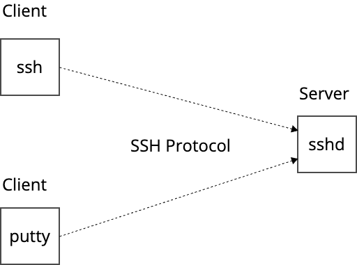

# regreSSHionについて

> The vulnerability, which is a signal handler race condition in **OpenSSH’s server (sshd)**, allows unauthenticated remote code execution (RCE) as root on glibc-based Linux systems; that presents a significant security risk. This race condition affects sshd in its default configuration.


## 概要

OpenSSH sshdというほぼすべてのLinuxサーバーにインストールされ、頻繁に使用されるSSHのサーバープログラム(`sshd`)に脆弱性(CVE-2024-6387)が発見されました。

[OpenSSH Vulnerability: CVE-2024-6387 FAQs and Resources \| Qualys](https://www.qualys.com/regresshion-cve-2024-6387/)

2006年に修正された同じ `sshd` に関するCVE-2006-5051の回帰(regression)バグであることから、この脆弱性には "regression" と同じ発音で綴りに "SSH" を含めた regreSSHion という名前がつけられました。

[シグナルハンドラの競合状態(CWE-364)](https://cwe.mitre.org/data/definitions/364.html)に分類される脆弱性です。

regreSSHion の詳細は、以下のリンクをご確認ください

- [OpenSSHの脆弱性 CVE-2024-6387についてまとめてみた - piyolog](https://piyolog.hatenadiary.jp/entry/2024/07/02/032122)
- [RegreSSHion: RCE in OpenSSH's server, on glibc-based Linux systems - Hacker News](https://news.ycombinator.com/item?id=40843778)

### CVEとは?

CVE(Common Vulnerabilities and Exposures)は脆弱性を一意な名前・IDで管理。

> The mission of the CVE® Program is to identify, define, and catalog publicly disclosed cybersecurity vulnerabilities.
>
> https://www.cve.org/About/Overview

今回見つかったOpen sshdの脆弱性の場合、regreSSHion という名前と CVE-2024-6387 という管理番号が割り振られています。

CVEの取り組みにより、sshdの開発者もsshdを配布するベンダーもサーバーの運用者もCVE IDで会話できます。

## SSH とは?

セキュアシェル(SSH)はネットワーク経由で安全にシェルアクセスするプロトコルです。

SSH 実装として OpenSSHプロジェクトによるクライアント向けの `ssh` とサーバー向けの `sshd` が多くの環境で利用されています。

Windows環境で利用される `putty` は SSH プロトコルを実装した SSH クライアントプログラムの一つです(`putty` にははSSH以外にも`telnet`など様々なプロトコルに対応しています)。



SSHの認証方式として以下があります。

- パスワード認証
    - 無効化されていることが多いです
- 公開鍵/秘密鍵ペアの公開鍵認証
    - [Amazon EC2が利用](https://docs.aws.amazon.com/AWSEC2/latest/UserGuide/connect-linux-inst-ssh.html)
- クライアント認証
    - [Netflixの利用例](https://zenn.dev/quiver/articles/32ec71c3eedb2b)

GitHub.com のレポジトリでもSSHの公開鍵認証が利用されています。

[About SSH - GitHub Docs](https://docs.github.com/en/authentication/connecting-to-github-with-ssh/about-ssh)

## 認証と regreSSHion の関係

今回の regreSSHionでは、クライアントが接続を試みて、`LoginGraceTime` で指定した一定時間内に認証が成功しないと、 `SIGALRM` というアラーム式のシグナルが非同期に呼び出され、そのシグナルハンドラー内の処理に脆弱性がありました。

回避策の一つとして紹介されている `LoginGraceTime=0` は、このログイン試行の機能を無効化し、`SIGALRM` が呼び出されないようにするというものです。

## コンテナへのシェルアクセス

SSHはサーバーの運用やトラブルシュートなどのために大昔から利用されています。

コンテナでは、コンテナランタイムがDockerの場合は `docker exec`、Container Runtime Interface (CRI)互換なランタイムの場合は `crictl exec` でシェルアクセス可能です。

```
$ docker exec -it mycontainer /bin/sh
bin   dev   etc   home  proc  root  sys   tmp   usr   var
```

AWSが提供するコンテナオーケストレーターのECSの場合、[ECS Exec](https://docs.aws.amazon.com/AmazonECS/latest/developerguide/ecs-exec.html) という同等の機能が提供されています。

```
$ aws ecs execute-command --cluster cluster-name \
    --task task-id \
    --container container-name \
    --interactive \
    --command "/bin/sh"
```

## 参考

- [openssh.com/txt/release-9.8 リリースノート](https://www.openssh.com/txt/release-9.8)
- [OpenSSHの脆弱性 CVE-2024-6387についてまとめてみた - piyolog](https://piyolog.hatenadiary.jp/entry/2024/07/02/032122)
- [OpenSSH Vulnerability: CVE-2024-6387 FAQs and Resources \| Qualys](https://www.qualys.com/regresshion-cve-2024-6387/)
- [Qualys の CVE-2024-6387 の詳細なレポート](https://www.qualys.com/2024/07/01/cve-2024-6387/regresshion.txt)
- [OpenSSH本体に取り込まれた脆弱性パッチ](https://github.com/openssh/openssh-portable/commit/81c1099d22b81ebfd20a334ce986c4f753b0db29)
- [脆弱性のミニマルパッチ](https://marc.info/?l=oss-security&m=171982317624594)