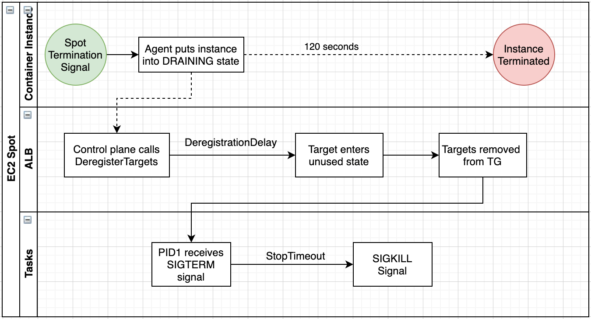

# シグナルとは?

シグナルを利用すると、実行中のプロセスに外から(非)同期な割り込みイベント処理を行えます。

Webサーバーの停止や再起動のような処理や、Ctrl-Cでプログラムを止める処理などがシグナルの利用例です。

シグナル送信時には `kill` コマンドでプロセスとシグナル(番号、または、名前)を指定します。

```
$ kill -signal_name pid
$ kill -signal_number pid
```

よく使われるシグナルとして、以下のものがあります

- SIGHUP(1)
    - プロセスの再起動や設定の再読み込み
- SIGINT(2)
    - プロセスに対して、キーボードからの割り込み(いわゆる「Ctrol-C」)
- SIGKILL(9)
    - 強制的にプロセスを終了させる
    - プロセスはこのシグナルを無視することができず、受信すると即座に終了する。
- SIGTERM(15)
    - プロセスに対して、終了を要求するシグナル。
    - プロセスはこのシグナルを受信すると、通常はクリーンアップを行ってから終了する。

## yes プロセスをシグナルで停止

2つのタブを開き、`yes` プロセスに対して、`SIGTERM` シグナルでプロセスを停止してみます。

| タブA | タブB |
| --- | --- |
| $ yes<br>y<br>y<br>y<br>... |  |
| ...<br>y<br>y | $ pgrep yes<br>1850<br>$ kill -SIGTERM 1850 |
| Terminated<br>$ |  |

フォアグラウンド実行しているプログラムを Ctrl-C で止めるのは、 `SIGINT` シグナルを送信していることと同じです。

`strace` というシステムコール(Linuxカーネル=OSの低レイヤーで行われる処理)やシグナルをトレースするプログラム経由で `yes` を走らせ、Ctrol-Cで強制終了してみましょう。

```
$ strace -ff -e trace=signal -o strace_output yes
y
y
...
y
^C

$ ls
strace_output.4275

$ cat strace_output.4275
--- SIGINT {si_signo=SIGINT, si_code=SI_KERNEL} ---
+++ killed by SIGINT +++
```

Ctrl-Cで `SIGINT` シグナルが発火され、`yes` プロセスが停止されてことがわかります。

## Apacheのシグナルの利用例

Apacheの場合、プロセスの停止や再起動はシグナル経由で行われます。

さらに、処理中のリクエストの終了を待つ場合("gracefulに処理する"と呼びます)と待たない場合で異なるシグナルが用意されています。

| シグナル | graceful? | 処理 | apachectlコマンド |
| --- | --- | --- | --- |
| HUP |  | リスタート | apachectl -k restart |
| USR1 | graceful | リスタート | apachectl -k graceful |
| TERM |  | 停止 | apachectl -k stop |
| WINCH | graceful | 停止 | apachectl -k graceful-stop |

特に、プロセスを管理する `systemd` 経由でApacheを stop/restart すると(つまり、デフォルトの stop/restart)、graceful に処理されます。

```
$ sudo systemctl reload apache2.service

$ systemctl status apache2
● apache2.service - The Apache HTTP Server
     Loaded: loaded (/lib/systemd/system/apache2.service; enabled; vendor preset: enabled)
     Active: active (running) since Wed 2024-07-10 06:22:22 UTC; 36min ago
       Docs: https://httpd.apache.org/docs/2.4/
    Process: 368 ExecStart=/usr/sbin/apachectl start (code=exited, status=0/SUCCESS)
    Process: 4371 ExecReload=/usr/sbin/apachectl graceful (code=exited, status=0/SUCCESS)
   Main PID: 492 (apache2)
      Tasks: 6 (limit: 2262)
     Memory: 26.2M
        CPU: 393ms
     CGroup: /system.slice/apache2.service
             ├─ 492 /usr/sbin/apache2 -k start
             ├─4379 /usr/sbin/apache2 -k start
             ├─4380 /usr/sbin/apache2 -k start
             ├─4381 /usr/sbin/apache2 -k start
             ├─4382 /usr/sbin/apache2 -k start
             └─4383 /usr/sbin/apache2 -k start

Jul 10 06:22:22 ip-172-31-34-13 systemd[1]: Starting The Apache HTTP Server...
Jul 10 06:22:22 ip-172-31-34-13 systemd[1]: Started The Apache HTTP Server.
Jul 10 06:58:44 ip-172-31-34-13 systemd[1]: Reloading The Apache HTTP Server...
Jul 10 06:58:44 ip-172-31-34-13 systemd[1]: Reloaded The Apache HTTP Server.
```

参考

- [Stopping and Restarting Apache HTTP Server - Apache HTTP Server Version 2.4](https://httpd.apache.org/docs/2.4/stopping.html)
- [Apache HTTP Serverのgraceful stop/restartを理解する - インフラエンジニアway - Powered by HEARTBEATS](https://heartbeats.jp/hbblog/2023/02/apache-http-servergraceful-stoprestart.html)


## AWSのロードバランサーのgracefulな処理

AWSのロードバランサー(ELB)も処理中のリクエストの終了を待つ graceful な処理が実装されています(`draining`で検索しましょう)。

ロードバランサーのターゲットから解除されたサーバーは、新規リクエストを受け付けず、既存のリクエストだけを処理する draining状態になり、一定期間後は強制的にリスエストが終了されます。

- [ALBのgraceful 機能](https://docs.aws.amazon.com/elasticloadbalancing/latest/application/load-balancer-target-groups.html#deregistration-delay)
- [ECSとALBの連携時の graceful 機能](https://docs.aws.amazon.com/AmazonECS/latest/bestpracticesguide/load-balancer-connection-draining.html)

## Pythonでシグナルハンドラーを設定

次のPythonプログラムは、`SIGINT`(Ctrl-C)シグナルを処理するハンドラーです。

```
# ChatGPTで生成
import signal
import time

# シグナルハンドラー関数の定義
def signal_handler(sig, frame):
    print('SIGINTを受け取りました！プログラムを終了します。')
    exit(0)

# シグナルハンドラーをSIGINTに関連付ける
signal.signal(signal.SIGINT, signal_handler)

print('Ctrl+Cを押してプログラムを終了してください。')
while True:
    print('プログラム実行中...')
    time.sleep(1)
```

このプログラム(`test_signal.py`)に対して、ハンドリングしているシグナルと、ハンドリングしていないシグナルを送って、処理の違いを確認します。

| タブA | タブB |
| --- | --- |
| $ python test_signal.py<br>Ctrl+Cを押してプログラムを終了してください。<br>プログラム実行中...<br>プログラム実行中... |  |
| プログラム実行中...<br>... | $ pgrep python3<br>4542<br>$ kill -SIGINT 4542 |
| SIGINTを受け取りました！プログラムを終了します。<br>$ |  |

`SIGINT`に対応するシグナルハンドラーが呼び出されました。

| タブA | タブB |
| --- | --- |
| $ python test_signal.py<br>Ctrl+Cを押してプログラムを終了してください。<br>プログラム実行中...<br>プログラム実行中... |  |
| プログラム実行中...<br>... | $ pgrep python3<br>4550<br>$ kill -SIGTERM 4550 |
| Terminated<br>$ |  |

`SIGINT`に対応するシグナルハンドラーは呼び出されず、一般的な `SIGTERM`の終わり方をしました。

## コンテナオーケストレーターAmazon ECSでのシグナルの利用例

コンテナ化したアプリケーションは、ワークロードに応じて柔軟にスケールできます。

これは、スケールインイベントが発生することを意味し、コンテナの停止命令に対して、正常の終了処理をする必要があります。

ここで活躍するのがシグナルです。

> アプリケーションが SIGTERM に対応できるようにしましょう。
> Amazon ECS は、タスクを停止する場合、まず SIGTERM シグナルをそのタスクに送信し、アプリケーションを終了してシャットダウンする必要があることを通知します。その後、Amazon ECS は SIGKILL のメッセージを送信します。アプリケーションが SIGTERM を無視した場合、Amazon ECS サービスはしばらく待ってからプロセスを終了する SIGKILL シグナルを送信する必要があります。
> [Best practices for Amazon ECS container images - Amazon Elastic Container Service](https://docs.aws.amazon.com/ja_jp/AmazonECS/latest/developerguide/container-considerations.html)

ECS はタスクに対してまず `SIGTERM` で正常終了を促し、それでもだめなときは `SIGKILL` で強制終了します。

次のAWS公式ブログでは、このベストプラクティスがALB/ECS/EC2スポットインスタンスの連携を踏まえてより具体的に解説されています。



[ECS のアプリケーションを正常にシャットダウンする方法 \| Amazon Web Services ブログ](https://aws.amazon.com/jp/blogs/news/graceful-shutdowns-with-ecs/)

## (発展)Amazon ECS以外でのシグナルの類似機能の応用例

負荷に応じてEC2インスタンスをスケールさせるAmazon EC2 Auto Scalingや未使用のEC2キャパシティを安く活用するEC2スポットインスタンスは、インスタンスの停止や中断を伴うため、ステートレスに実装する必要があります。

このような予告に対して、クリーンアップする処理はまさに、シグナルの`SIGTERM`と同じ発想です。

EC2 AutoScalingのライフサイクルフックやスポットインスタンスの中断イベントを調べてみましょう。

- [Amazon EC2 Auto Scaling lifecycle hooks - Amazon EC2 Auto Scaling](https://docs.aws.amazon.com/autoscaling/ec2/userguide/lifecycle-hooks.html)
- [Spot Instance interruptions - Amazon Elastic Compute Cloud](https://docs.aws.amazon.com/AWSEC2/latest/UserGuide/spot-interruptions.html)

## 最難関:シグナルの安全性

様々なスレッド･プロセスから呼び出されるシグナルハンドラー内の処理には大きな制約があり、この制約が守られないと、今回のregreSSHion(⁠CVE-2024-6387)のようなにシグナルハンドラー内で競合状態が発生し、脆弱性に繋がりるリスクがあります。

非同期シグナルにおいて、シグナルハンドラー内で呼び出しても大丈夫な関数は **非同期シグナル安全関数(async-signal-safe function)** と呼ばれ、`write()`, `wait()`, `signal()` などがあります。

安全でない関数の代表例が、最も基本的な関数の一つである `printf()` です。

複数のスレッド･プロセスから同時に呼び出されても、正しく動作する関数を再入可能(reentrant)関数と呼びます。
関数がバッファやヒープなどのグローバルなデータを使っていると、再入不可能となります。

一見すると、`printf()`は reentrant に見えますが、内部でグローバルなバッファを操作しているため、 再入可能ではりません(non-reentrant)。

`$ man 7 signal-safety` を読んでみましょう。`man` ページの冒頭を引用します。

> An  async-signal-safe  function  is one that can be safely called from within a signal handler.  Many functions are not async-signal-safe.  In particular, nonreentrant functions are generally unsafe to call from a signal handler.

参考

- [signal-safety(7) - Linux manual page](https://man7.org/linux/man-pages/man7/signal-safety.7.html)
- [CWE - CWE-364: Signal Handler Race Condition (4.14)](https://cwe.mitre.org/data/definitions/364.html)
- [c - Why are malloc() and printf() said as non-reentrant? - Stack Overflow](https://stackoverflow.com/questions/3941271/why-are-malloc-and-printf-said-as-non-reentrant)
