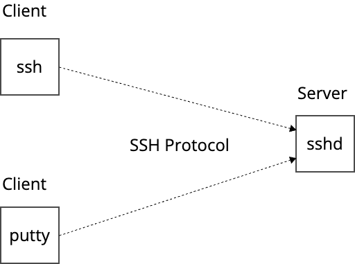

# SSH について

> The vulnerability, which is a signal handler race condition in **OpenSSH’s server (sshd)**, allows unauthenticated remote code execution (RCE) as root on glibc-based Linux systems; that presents a significant security risk. This race condition affects **sshd** in its default configuration.

セキュアシェル(SSH)はネットワーク経由で安全にシェルアクセスするプロトコルです。

SSH 実装として OpenSSHプロジェクトによるクライアント向けの `ssh` とサーバー向けの `sshd` が多くの環境で利用されています。

Windows環境で利用される `putty` は SSH プロトコルを実装した SSH クライアントプログラムの一つです(`putty` はSSH以外にも`telnet`など様々なプロトコルに対応しています)。



SSHの認証方式として以下があります。

- パスワード認証
    - 無効化されていることが多いです
- 公開鍵/秘密鍵ペアの公開鍵認証
    - [Amazon EC2が利用](https://docs.aws.amazon.com/AWSEC2/latest/UserGuide/connect-linux-inst-ssh.html)
- クライアント認証
    - [Netflixの利用例](https://zenn.dev/quiver/articles/32ec71c3eedb2b)

GitHub.com のレポジトリでもSSHの公開鍵認証が利用されています。

[About SSH - GitHub Docs](https://docs.github.com/en/authentication/connecting-to-github-with-ssh/about-ssh)

## SSH認証と regreSSHion の関係

OpenSSHのsshdは、クライアントが接続を試み、`LoginGraceTime` で指定した時間内に認証が成功しないと、 `SIGALRM` というアラーム式のシグナルが非同期に呼び出されます。

今回の regreSSHionでは、`glibc`を利用したLinuxにおいて、このシグナルハンドラー内の処理に脆弱性がありました。

回避策の一つとして紹介されている `LoginGraceTime=0` は、このログイン試行のタイムアウト機能を無効化し、`SIGALRM` が呼び出さないようにするというものです。

## コンテナへのシェルアクセス

SSHはサーバーの運用やトラブルシュートなどのために古くから利用されています。

コンテナでは、コンテナランタイムがDockerの場合は `docker exec`、Container Runtime Interface (CRI)互換なランタイムの場合は `crictl exec` でシェルアクセス可能です。

```
$ docker exec -it mycontainer /bin/sh
bin   dev   etc   home  proc  root  sys   tmp   usr   var
```

AWSが提供するコンテナオーケストレーターのECSの場合、[ECS Exec](https://docs.aws.amazon.com/AmazonECS/latest/developerguide/ecs-exec.html) という同等の機能が提供されています。

```
$ aws ecs execute-command --cluster cluster-name \
    --task task-id \
    --container container-name \
    --interactive \
    --command "/bin/sh"
```