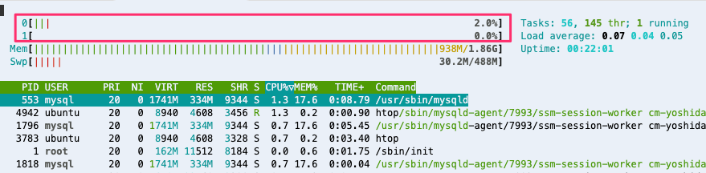

# スレッドとは?

プロセスの中で、並列化可能な単位に処理を分割し、複数の処理を行うことも可能です。この処理の単位をスレッドと呼びます。

MySQLのようなデータベースサーバーでは、クライアントからのSQL処理を複数のスレッドで処理したり、レプリケーションのような管理系処理を特定のスレッドで処理したりしています。

## Apacheのスケールアウト戦略

Webサーバーはたくさんのクライアントのリクエストを同時に処理する必要があります。

同じ処理をスケールアウトするための手段として

- マルチプロセス
- マルチスレッド

の2通りがあります。

ApacheはMulti-Processing Module(MPM)がこの機構を担っており、プロセス方式([prefork](https://httpd.apache.org/docs/2.4/mod/prefork.html))とスレッド方式([worker](https://httpd.apache.org/docs/2.4/mod/worker.html)/[event](https://httpd.apache.org/docs/2.4/mod/event.html))の両方が存在します。
eventはApache 2.2から追加されたworkerのバリエーションであり、Ubuntu 22.04 のデフォルトパッケージのApache2はevent方式で起動されています。

event 方式の機能概要をドキュメントから引用します。

> The event Multi-Processing Module (MPM) is designed to allow more requests to be served simultaneously by passing off some processing work to the listeners threads, freeing up the worker threads to serve new requests.
>
> [event - Apache HTTP Server Version 2.4](https://httpd.apache.org/docs/2.4/mod/event.html)

## event型Apacheの動作を確認

設定ファイルからわかるように、複数のプロセスを起動させ(`StartServers`)、各プロセスをマルチスレッド(`ThreadsPerChild`)で動作させています。

```
$ cat /etc/apache2/mods-enabled/mpm_event.conf
# event MPM
# StartServers: initial number of server processes to start
# MinSpareThreads: minimum number of worker threads which are kept spare
# MaxSpareThreads: maximum number of worker threads which are kept spare
# ThreadsPerChild: constant number of worker threads in each server process
# MaxRequestWorkers: maximum number of worker threads
# MaxConnectionsPerChild: maximum number of requests a server process serves
StartServers            2
MinSpareThreads         25
MaxSpareThreads         75
ThreadLimit             64
ThreadsPerChild         25
MaxRequestWorkers       150
MaxConnectionsPerChild  0
```

Apacheプロセスを確認しましょう。

```
$ ps -f -p $(pgrep apache2)
UID          PID    PPID  C STIME TTY      STAT   TIME CMD
root        1468       1  0 04:19 ?        Ss     0:01 /usr/sbin/apache2 -k start
www-data    1471    1468  0 04:19 ?        Sl     0:00 /usr/sbin/apache2 -k start
www-data    1472    1468  0 04:19 ?        Sl     0:00 /usr/sbin/apache2 -k start
```

`ps` に `-T` オプションを渡すと、`SPID` 列にスレッドIDを表示できます。

```
$ ps -T -p $(pgrep apache2)
    PID    SPID TTY      STAT   TIME COMMAND
   1468    1468 ?        Ss     0:01 /usr/sbin/apache2 -k start
   1471    1471 ?        Sl     0:00 /usr/sbin/apache2 -k start
   1471    1475 ?        Sl     0:00 /usr/sbin/apache2 -k start
   1471    1476 ?        Sl     0:00 /usr/sbin/apache2 -k start
   1471    1477 ?        Sl     0:00 /usr/sbin/apache2 -k start
   1471    1480 ?        Sl     0:00 /usr/sbin/apache2 -k start
   1471    1482 ?        Sl     0:00 /usr/sbin/apache2 -k start
   1471    1483 ?        Sl     0:00 /usr/sbin/apache2 -k start
   1471    1486 ?        Sl     0:00 /usr/sbin/apache2 -k start
   1471    1488 ?        Sl     0:00 /usr/sbin/apache2 -k start
   1471    1489 ?        Sl     0:00 /usr/sbin/apache2 -k start
   1471    1491 ?        Sl     0:00 /usr/sbin/apache2 -k start
   1471    1493 ?        Sl     0:00 /usr/sbin/apache2 -k start
   1471    1495 ?        Sl     0:00 /usr/sbin/apache2 -k start
   1471    1497 ?        Sl     0:00 /usr/sbin/apache2 -k start
   1471    1502 ?        Sl     0:00 /usr/sbin/apache2 -k start
   1471    1503 ?        Sl     0:00 /usr/sbin/apache2 -k start
   1471    1505 ?        Sl     0:00 /usr/sbin/apache2 -k start
   1471    1507 ?        Sl     0:00 /usr/sbin/apache2 -k start
   1471    1509 ?        Sl     0:00 /usr/sbin/apache2 -k start
   1471    1510 ?        Sl     0:00 /usr/sbin/apache2 -k start
   1471    1512 ?        Sl     0:00 /usr/sbin/apache2 -k start
   1471    1514 ?        Sl     0:00 /usr/sbin/apache2 -k start
   1471    1516 ?        Sl     0:00 /usr/sbin/apache2 -k start
   1471    1518 ?        Sl     0:00 /usr/sbin/apache2 -k start
   1471    1520 ?        Sl     0:00 /usr/sbin/apache2 -k start
   1471    1522 ?        Sl     0:00 /usr/sbin/apache2 -k start
   1471    1524 ?        Sl     0:00 /usr/sbin/apache2 -k start
   1472    1472 ?        Sl     0:00 /usr/sbin/apache2 -k start
   1472    1478 ?        Sl     0:00 /usr/sbin/apache2 -k start
   1472    1479 ?        Sl     0:00 /usr/sbin/apache2 -k start
   1472    1481 ?        Sl     0:00 /usr/sbin/apache2 -k start
   1472    1484 ?        Sl     0:00 /usr/sbin/apache2 -k start
   1472    1485 ?        Sl     0:00 /usr/sbin/apache2 -k start
   1472    1487 ?        Sl     0:00 /usr/sbin/apache2 -k start
   1472    1490 ?        Sl     0:00 /usr/sbin/apache2 -k start
   1472    1492 ?        Sl     0:00 /usr/sbin/apache2 -k start
   1472    1494 ?        Sl     0:00 /usr/sbin/apache2 -k start
   1472    1496 ?        Sl     0:00 /usr/sbin/apache2 -k start
   1472    1498 ?        Sl     0:00 /usr/sbin/apache2 -k start
   1472    1499 ?        Sl     0:00 /usr/sbin/apache2 -k start
   1472    1500 ?        Sl     0:00 /usr/sbin/apache2 -k start
   1472    1501 ?        Sl     0:00 /usr/sbin/apache2 -k start
   1472    1504 ?        Sl     0:00 /usr/sbin/apache2 -k start
   1472    1506 ?        Sl     0:00 /usr/sbin/apache2 -k start
   1472    1508 ?        Sl     0:00 /usr/sbin/apache2 -k start
   1472    1511 ?        Sl     0:00 /usr/sbin/apache2 -k start
   1472    1513 ?        Sl     0:00 /usr/sbin/apache2 -k start
   1472    1515 ?        Sl     0:00 /usr/sbin/apache2 -k start
   1472    1517 ?        Sl     0:00 /usr/sbin/apache2 -k start
   1472    1519 ?        Sl     0:00 /usr/sbin/apache2 -k start
   1472    1521 ?        Sl     0:00 /usr/sbin/apache2 -k start
   1472    1523 ?        Sl     0:00 /usr/sbin/apache2 -k start
   1472    1525 ?        Sl     0:00 /usr/sbin/apache2 -k start
   1472    1526 ?        Sl     0:00 /usr/sbin/apache2 -k start
```

`STAT` 列の `Ss` や `Sl` の意味は`$ man 1 ps` で確認できます。

1つ目のSはスリープ状態であることを表します(Apacheは外に公開していないのでリクエストがありません)。

2つ目の `s` はセッションリーダー(`root`権限で利用されている特別なプロセス)、`l`はマルチスレッドであることを表します。

```
$ man 1 ps
...

PROCESS STATE CODES
       Here are the different values that the s, stat and state output specifiers (header "STAT" or "S") will display to describe the state of a process:

               D    uninterruptible sleep (usually IO)
               I    Idle kernel thread
               R    running or runnable (on run queue)
               S    interruptible sleep (waiting for an event to complete)
               T    stopped by job control signal
               t    stopped by debugger during the tracing
               W    paging (not valid since the 2.6.xx kernel)
               X    dead (should never be seen)
               Z    defunct ("zombie") process, terminated but not reaped by its parent

       For BSD formats and when the stat keyword is used, additional characters may be displayed:

               <    high-priority (not nice to other users)
               N    low-priority (nice to other users)
               L    has pages locked into memory (for real-time and custom IO)
               s    is a session leader
               l    is multi-threaded (using CLONE_THREAD, like NPTL pthreads do)
               +    is in the foreground process group
...
```

`/proc` ディレクトリ以下にはプロセスの情報がファイル管理されています。

`/proc/PID/task/` ディレクトリ以下には数字のディレクトリが並んでおり、各数字は先ほど`ps -T` で確認したスレッドIDを表します。

```
$ ls -F /proc/1471/task/
1471/  1475/  1476/  1477/  1480/  1482/  1483/  1486/  1488/  1489/  1491/  1493/  1495/  1497/  1502/  1503/  1505/  1507/  1509/  1510/  1512/  1514/  1516/  1518/  1520/  1522/  1524/
```

## スレッド･プロセスとリソース共有

マルチスレッドとマルチプロセスの大きな違いの一つは、マルチスレッドはプロセスを共有するため、メモリなどのリソースをスレッド間で共有できるのに対して、マルチプロセスの場合、プロセス間通信(IPC)で共有する必要があることです。

このスレッドの特性はメリットのようにも見えますが、意図せず共有されることによる難しい不具合を起こしやすく、regreSSHionも広義では同類の脆弱性です。

プロセス間通信は古くはSystem V IPCというメッセージキュー、セマフォ、共有メモリのAPIがLinux以前のUNIXのころから存在し(System VはUNIXの一種)、Linux時代になって、Posix IPC というきれいなAPIとして整理されました。

## 並行と並列の違い

マルチスレッド・マルチプロセスで処理するときは、平行(Concurrent)と並列(Parallel)の違いを意識する必要があります。

並列は複数のタスクを同時に実行し、並行は複数のタスクを並列あるいは細切れにいったりきたりしながら(コンテキストスイッチ)実行します。

- シンプル説明 [並行処理と並列処理 - Goでの並行処理を徹底解剖！](https://zenn.dev/hsaki/books/golang-concurrency/viewer/term)
- 難しい説明 [たとえばなしで見る誇張の少ない「並行」と「並列」](https://zenn.dev/koron/articles/05210473c8fc62f5e8fb)

## 発展:CPUのスレッド

プロセスと関連したスレッドとは別に **ハイパースレッディング** というスレッドもよく耳にします。

CPUの物理的なプロセッサコアを複数の論理的なコアのようにみせかけることを一般に **Simultaneous Multi-Threading(SMT)** とよび、Intel社の技術を特別に **ハイパースレッディング** と呼びます。

x86系のIntel/AMDのCPUは一般的にこの技術が備わっており、ARM系ではこの技術は採用されていません。

Amazon EC2のvCPU数は、論理コア数です。

そのため、Intel/AMDのvCPU数は物理コアの2倍であり、Arm(Graviton)のvCPU数は物理コア数と同じです。

次の出力はx86なEC2インスタンスのCPU情報です。

```
$ egrep -E 'physical id|processor' /proc/cpuinfo
processor       : 0
physical id     : 0
processor       : 1
physical id     : 0
```

physical idは0しか存在しないため、物理コア数は1、processorは0と1が存在するため、論理コア数は2でSMTが有効とわかります。

SMTが有効で論理コア数が2N個の環境に対して2N並列でそれぞれが100%の負荷をかけると、計算機の並列度は物理コア数と同じN個で2N並行に処理します。

ARMなAWS GravitonでRDBに上記負荷をかけた例

[Amazon AuroraがARMベースのGraviton2プロセッサを搭載したインスタンスタイプのプレビューを開始 #reinvent - DevelopersIO](https://dev.classmethod.jp/articles/amazon-aurora-supports-gravition-2-as-public-preview/)

`htop` コマンドを利用すると、論理CPUごとの使用率を確認できます。



最新のCPU技術の進化に伴い、Intelは次世代CPU「Lunar Lake」から、一部のモデルでSMTを無効化し、シングルスレッドでの性能向上や省電力化にかじを切りました。

[Lion Cove P-core Architecture Explained by Intel Engineer | Talking Tech | Intel Technology - YouTube](https://www.youtube.com/watch?v=7RcEPqn5ejM)
